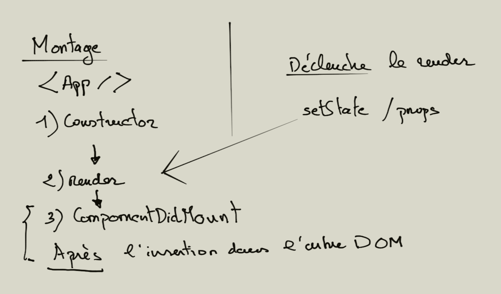

# React life cycle

Dans une application avec de nombreux composants, il est très important de libérer les ressources utilisées. Le life cycle vous permettra au montage et démontage de mettre en place des stratégies dans ce sens.

Le cycle de vie ne s'arrête pas à cet exemple, il vous permettra d'implémenter des logiques au montage ou à la mise à jour des props/states de votre composant également.

React implémente **des méthodes pré-définies** permettant de maîtriser le cycle d'exécution (lifecycle) du code d'un Component.

Nous abordons le cycle de vie uniquement dans le cadre des classes ES6 pour définir un composant. Le cycle de vie peut être également implémenté dans les fonctions qui définissent des composants. Nous verrons ces techniques plus loin dans le cours.

## 3 méthodes du Life/Cycle fondamentales

Trois méthodes sont faciles à appréhender dans une classe React au sein du life cycle de React :

1. Le constructeur : il est éxecuté en premier, à l'instanciation de la classe.

```js

constructor(props){
    // ...
}

```

2. La méthode de React **componentDidMount** est exécutée une fois que le composant React est monté dans le DOM.

```js

componentDidMount(){
    // ...
}

```

3. La méthode **componentWillUnmount** est exécutée lorsqu'on démonte le composant (suppression de la variable composant dans le script).

```js

componentWillUnmount(){
    // ...
}

```



\newpage

## 1. Exercice Clocks

Créez deux composants (classes), la première App contiendra une horloge, c'est à dire un composant Clock. Dans le composant App vous allez gérer le démontage de l'horloge : au bout de 5 secondes l'horloge est démontée. En utilisant le cycle de vie trouvez la bonne manière d'implémenter le démarrage et l'arrêt de cette horloge. Vous ne supprimerez pas le container mais uniquement le composant Clock pour répondre à la problématique posée dans cet exercice.

Hiérarchie des composants :

```text

    App
     .
     .
    Clock

h/m/s

```

## Autres méthodes du Life Cycle

Nous allons voir une méthode qui s'exécute lorsque les props ou state changent dans le composant.

Vous pouvez utiliser setState dans cette méthode, **mais** attention à mettre dans ce cas une condition sur l'état des props ou state pour ne pas avoir une boucle infinie dans le rendu.

```js

  componentDidUpdate(prevProps, prevStates) {

      if (this.state.count !== prevStates.count) {
          console.log( 'new state count :' , this.state.count, 'old state count',  prevStates.count)
      }
  }

```

Retenez l'existence de ces méthodes dans le cycle de vie de React, il en existe d'autres mais la philosophie de React tend à n'utililser que celles que nous venons de voir.

En résumé retenez l'existence des méthodes suivantes dans le cycle de vie :

- constructor

- render

- componentDidMount

- componentWillUnmount

- componentDidUpdate

- setState / props


## Exercice life cycle

En vous aidant du life cycle de React créez un pavage dynamique d'étoiles. Chaque ligne doit comporter 20 étoiles. Découpez l'exercice en plusieurs parties.

1. Dans un premier temps tracez une ligne de 20 étoiles l'une à la suite de l'autre avec un délais de 500ms.
2. Tracez une ligne puis une fois celle-ci tracée supprimez la.
3. (difficile) Maintenant faite en sorte que chaque étoile sur une ligne s'affiche avec un délais de 500ms. Une fois que la ligne comporte 20 étoiles passez à la ligne suivante. Vous devez tracer 10 lignes au total.

```text

* * * * ...

```


