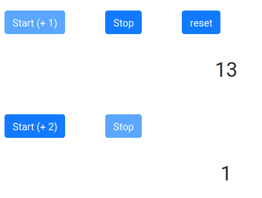

# Gestion des événements

Attention les **événements** dans **React** (similaires aux événements du DOM) s'écrivent en **camelCase**. En JSX on passe des fonctions aux événements plutôt que des "strings" :

```js
{/* passage d'une méthode */}
<button onClick={this.makeChoice}>
  Your choice
</button>
```

En React vous ne pouvez pas retourner un false pour empêcher un comportement par défaut dans élément HTML. Vous devez explicitement l'écrire avec **preventDefault**, voyez l'exemple qui suit :

```js

// Approche fonctionnelle pour définir un composant
const Action = () => {
  function handleClick(event) {
    event.preventDefault();
    console.log('Stopped !');
  }

  // React render
  return (
    <a href="#" onClick={handleClick}>
      Click me
    </a>
  );
}
```

## Exercice Class et événement Click Me

Considérez l'exemple suivant et répondez à la question ci-après :

```js

class Button extends React.Component{
  constructor(props){
    super(props);
  }

  click(){
    console.log(this.props);
  }

  render(){
    return (
      <button name="Hello React" onClick={this.click}>Clike Me !</button>
    )
  }
}

ReactDOM.render(<Button />, document.getElementById('root'))

```

Question :

Si on clique sur le bouton "Click Me!", alors console.log retournera un "undefined", pourquoi ?

Réponse :

Dans le code ci-dessus on ne récupère pas le this de la classe mais celui du contexte du DOM. Pour éviter cela vous pouvez passer par une fonction flèchée ou utiliser la méthode bind de JS :

**Première solution avec la méthode bind :**

Cette méthode permet de lier la méthode à sa classe.

```js
class Button extends React.Component{
  constructor(props){
    super(props);
    // lié la méthode au this de la classe
    this.click = this.click.bind(this);
  }

  click(){
    console.log(this.props);
  }

  render(){
    return (
      <button name="Hello React" onClick={this.click}>Clike Me !</button>
    )
  }
}

// ...
```

## Exercice counter + / -

1. Créez deux boutons le premier incremente le compteur de + 1 et l'autre de moins -1. Affichez ce dernier dans le DOM.

2. Faites en sorte que l'on ne puisse pas décrémenter en dessous de la valeur 0. Affichez un message d'avertissement sous le compteur pour le signaler lorsque l'utilisateur décrémente en dessous de 0. Pour l'implémentation de cette spécificité appliquez les bonnes pratiques UX.

## 1. Exercice Compteur

Créez deux compteurs (composants) qui se déclenchent à l'aide d'un bouton **start**. Le premier compteur s'incrémente de +1, le deuxième compteur s'incrémente de +2. Vous pouvez jouer avec les props des composants pour fixer la valeur de l'incrémentation, chaque composant aura ainsi sa propre configuration.

Associez pour chaque compteur un bouton stop qui permet d'arrêter le compteur correspondant.

Mettez une propriété **disabled** sur le start et le stop, disabled sera placé sur stop si on n'a pas appuyé sur start et réciproquement.

Options possibles à notre exercice

- Les compteurs doivent tous s'arrêter lorsqu'ils atteignent 20, vous pouvez soit tout ré-initialiser, soit arrêter le compteur et laisser la valeur la valeur 20 affichée. 

- Si vous avez le temps développer un compteur cyclique et un compteur binaire.



