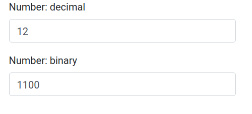

# TP Lifting State Up

Parfois des composants doivent faire remonter des données dynamiques à leur parent direct. Nous allons découvrir cette technique dans un exercice d'application.

Vous pouvez utiliser CRA & Styled Component.

## 1. Partie 1/2

Vous allez créer un script React permettant de réaliser une conversion de nombre décimal vers un nombre binaire.

Créez deux composants **App** et **BaseNumberInput**. Le composant App contiendra deux composants BaseNumberInput : respectivement pour saisir le nombre décimal et afficher le nombre binaire.

```txt

Nombre décimal : [ ... ]
Nombre binaire : [ ... ]

```

Hiérarchie des composants :

```txt
                 App
                .    .
            .            .
BaseNumberInput    BaseNumberInput
```

Dans le composant BaseNumberInput l'attribut onChangeBase sera appelé dans le composant lui-même. La logique algorithmique du changement de base sera implémentée dans le composant parent App (méthode this.handleChange) :

```js

<BaseNumberInput onChangeBase={(e) => this.handleChange(e)} />

// Dans le composant BaseNumberInput
this.props.onChangeBase(e.target.value)

```



## 2. Partie 2/2

Implémentez la logique dans l'autre sens : si on rentre un nombre binaire dans le champ correspondant alors la conversion se fait dans l'autre sens (binaire vers décimal).

## 3. Conversion

Reprendre l'exercice précédent, vous allez maintenant proposer un menu déroulant permettant de choisir la base dans laquelle on souhaite faire la conversion, utilisez les bases de conversion suivantes : 2, 3, et 7. Un champ de saisi en base 10 sera accessible dans le formulaire par défaut. Une fois la base sélectionnée le champ de saisi de cette base apparaîtra. Par défaut aucune base ne sera sélectionnée. Aidez vous des wireframes ci-dessous :

wireframe 1 : aucune base sélectionnée

```text
base 10
[ 1928 ]

Choisissez une base : [aucune base]  <--- Menu déroulant par défaut aucune base 

```

wireframe 2 : une fois la base sélectionnée le champ de saisie apparaîtra et la conversion peut alors se faire

```text
base 10
[ 1928 ]

base 7
[ 5423 ]

```